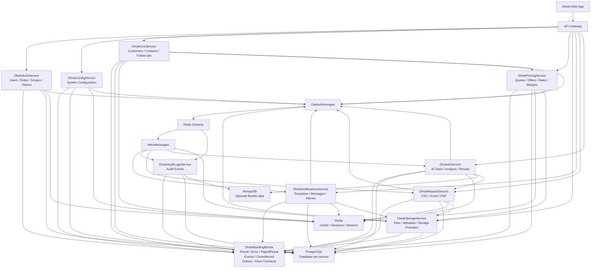

# Diagrama de Arquitectura - Dhole Microservices

## Objetivo

Este documento muestra la arquitectura general de Dhole Microservices de forma simple y entendible.

El objetivo del diagrama es representar:

- La entrada del sistema.
- Los microservicios principales.
- La base técnica compartida.
- La persistencia por servicio.
- La comunicación asíncrona mediante eventos.
- Los servicios complementarios.

---

## Diagrama general



---

## Explicación de la arquitectura

### 1. Dhole Web App

Es la aplicación cliente que consume las APIs del ecosistema Dhole.

Todas las peticiones entran por el API Gateway.

---

### 2. API Gateway

El API Gateway centraliza la entrada hacia los microservicios.

Sus responsabilidades principales son:

- Recibir peticiones del frontend.
- Redirigir peticiones al servicio correspondiente.
- Validar autenticación base.
- Propagar el CorrelationId.
- Mantener una entrada ordenada al ecosistema.

---

### 3. DholeBuildingBlocks

Es la base técnica compartida del sistema.

Debe contener contratos y estructuras comunes como:

- Result
- Error
- PagedResult
- IntegrationEvent
- EventEnvelope
- CorrelationId
- Contratos de Outbox
- Contratos de Inbox

No debe contener reglas de negocio de ningún servicio.

---

### 4. Microservicios

Los servicios definidos son:

| Servicio                  | Responsabilidad                             |
| ------------------------- | ------------------------------------------- |
| DholeAuthService          | Usuarios, roles, scopes, tokens y sesiones  |
| DholeConfigService        | Configuración general del sistema           |
| DholeCrmService           | Clientes, contactos y seguimientos          |
| DholePricingService       | Cotizaciones, ofertas, tarifas y márgenes   |
| DholeStorageService       | Archivos, metadata y proveedores de storage |
| DholeNotificationsService | Plantillas, mensajes y reintentos           |
| DholeAuditLogsService     | Auditoría genérica del sistema              |
| DholeReportsService       | Reportes CSV, Excel y PDF                   |
| DholeAiService            | Tareas de IA, análisis y resultados         |

---

### 5. Persistencia

Cada servicio debe tener su propia base de datos o esquema independiente.

La base principal será:

```text
PostgreSQL
```

Redis se usará para:

```text
Cache
Sessions
Permissions cache
Redis Streams
Distributed locks
Temporary idempotency
```

MongoDB será opcional para datos flexibles, especialmente en:

```text
AuditLogs
AI
```

---

### 6. Comunicación síncrona

La comunicación síncrona se realiza por HTTP.

Se usará cuando un servicio necesita una respuesta inmediata.

Ejemplos:

```text
API Gateway -> Auth
CRM -> Pricing
Pricing -> Storage
Reports -> Storage
AI -> Reports
```

---

### 7. Comunicación asíncrona

La comunicación asíncrona usa:

```text
OutboxMessages -> Redis Streams -> InboxMessages
```

Esto permite publicar eventos de forma confiable y consumirlos de forma idempotente.

---

### 8. Outbox

Cada servicio que publique eventos debe guardar primero el evento en su tabla `OutboxMessages`.

Luego un worker publica el evento en Redis Streams.

---

### 9. Inbox

Cada servicio que consuma eventos debe registrar el evento en `InboxMessages`.

Esto evita procesar dos veces el mismo evento.

---

## Reglas de arquitectura

```text
1. Cada servicio tiene su propia base de datos.
2. Ningún servicio accede directamente a la base de otro servicio.
3. Los permisos se manejan mediante scopes.
4. Los eventos se publican mediante Outbox.
5. Los eventos se consumen mediante Inbox.
6. Redis Streams se usa para comunicación asíncrona.
7. DholeBuildingBlocks no contiene reglas de negocio.
8. Storage maneja archivos de forma genérica.
9. Reports genera CSV, Excel y PDF.
10. AuditLogs registra eventos relevantes del ecosistema.
```
